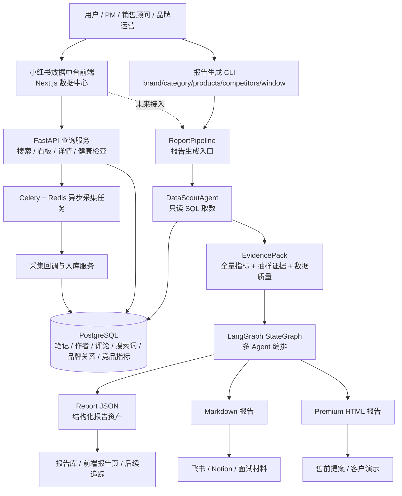
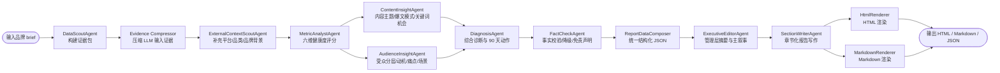
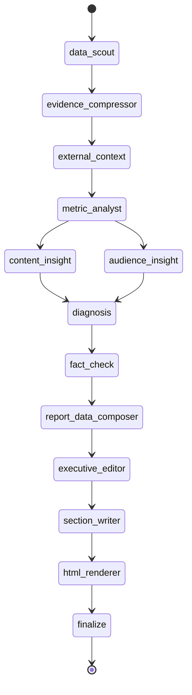
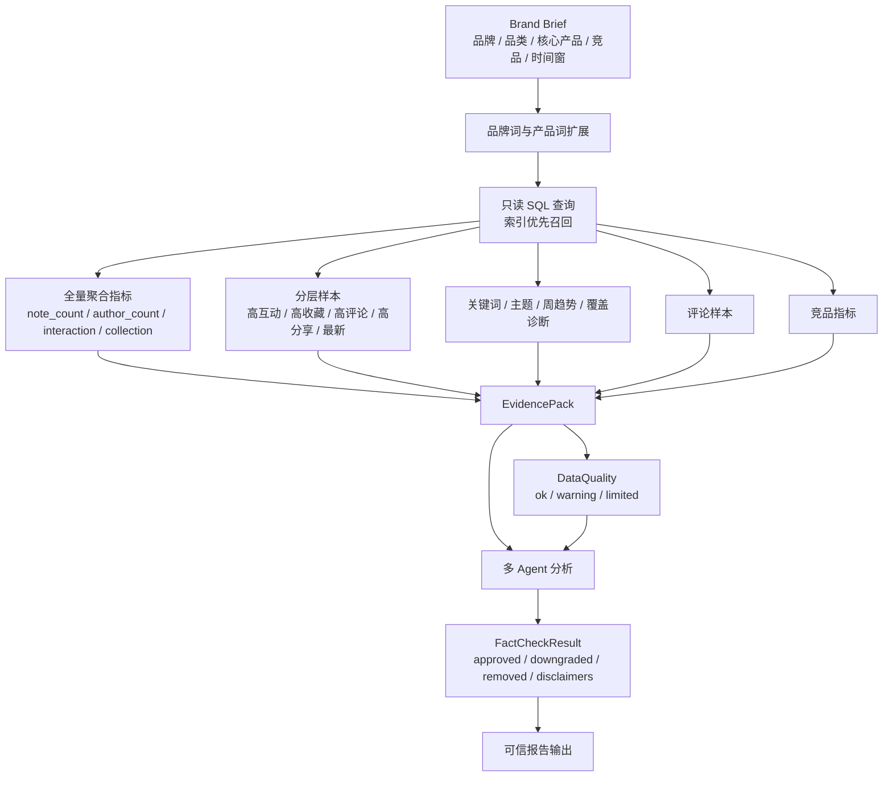

# 小红书数据中台智能报告 Agent 架构与协作图

版本：v1.0  
文档类型：架构图 / Agent 协作图 / 面试展示材料  
项目名称：小红书数据中台智能报告 Agent  
日期：2026-04-29

## 1. 产品总架构图

这张图的表达重点：数据中台负责采集、存储、搜索和看板；智能报告 Agent 负责把数据资产转成洞察资产。两者组合后，产品从“数据可查”升级为“结论可交付”。

## 2. Agent 协作流程图

协作设计的核心是“先结构化分析，再编辑表达”。指标、内容、受众和诊断节点分别产出结构化结果，FactCheckAgent 负责守住可信边界，最后再进入总编和章节写作。

## 3. LangGraph 编排图

项目使用 LangGraph `StateGraph` 编排，状态对象是 `ReportState`。每个节点只读上一阶段必要字段，并向 state 写入自己的结构化产物。当前链路以确定顺序为主，但内容洞察和受众洞察在产品逻辑上是并行分支，未来可进一步异步化。

## 4. 数据流与证据链

这个设计可以在面试里强调一点：报告不是“大模型自由发挥”，而是“数据库证据包驱动的大模型分析”。因此，系统能解释数字来源，也能在数据不足时主动降级。

## 5. 模块职责

| 模块 | 主要职责 | 产品价值 |
| --- | --- | --- |
| XHS Data Center | 采集、回调、入库、搜索、看板、详情页 | 沉淀小红书数据资产 |
| DataScoutAgent | 从 PostgreSQL 生成 EvidencePack | 把底层数据变成报告可用证据 |
| LangGraph Workflow | 编排多 Agent 节点和 checkpoint | 让报告链路可追踪、可恢复 |
| JsonAgent / OfflineAgent | LLM JSON 输出或本地离线 fallback | 兼顾质量、稳定性和验证便利 |
| ReportDataComposer | 汇总分析结果为统一 JSON | 让报告能被前端和系统复用 |
| ExecutiveEditorAgent | 管理层摘要和主叙事 | 提升报告可读性和商业表达 |
| SectionWriterAgent | 生成章节化报告内容 | 让报告接近咨询交付物 |
| Renderers | 输出 Markdown 和 HTML | 覆盖内部文档和客户演示场景 |

## 6. 技术与产品取舍

**为什么不只做看板？**  
看板适合探索数据，但管理层和客户更需要明确结论。Agent 报告层把“用户自己看数据”变成“系统给出诊断和行动建议”。

**为什么需要多个 Agent？**  
品牌健康度报告包含指标、内容、受众、诊断、事实校验和表达。拆成多个 Agent 后，每个节点职责清晰，输出结构可验证，也便于后续替换模型或单独优化。

**为什么输出 JSON？**  
Markdown 和 HTML 解决阅读和展示，JSON 解决产品化复用。未来报告库、品牌页报告卡片、历史对比和行动追踪都可以基于 JSON 扩展。

**为什么保留 offline 模式？**  
offline 模式可以在不调用外部 LLM 的情况下验证取数、编排、schema、渲染和降级链路，适合测试、演示和异常排查。

## 7. 面试讲述建议

可以用这条主线介绍项目：

1. 我先做了小红书数据中台，解决数据采集、搜索、看板和详情页的数据资产沉淀问题。
2. 但真实业务里，品牌方不只需要查数据，还需要能拿去开会和提案的诊断报告。
3. 所以我在数据中台上设计了智能报告 Agent，把数据库里的笔记、评论、达人、关键词和竞品指标转成 EvidencePack。
4. 再通过多 Agent 分工，完成指标分析、内容洞察、受众洞察、诊断建议、事实校验和报告写作。
5. 最终输出 Markdown、HTML、JSON，分别服务文档协作、客户演示和系统复用。
6. 这个项目的关键不是“让 AI 写得更像报告”，而是“让 AI 基于可信数据和证据链生成可交付的业务结论”。

